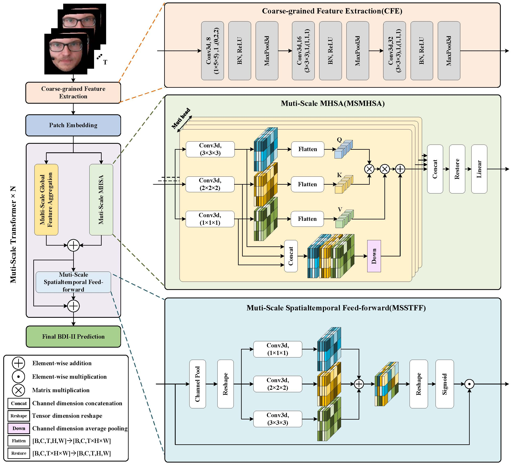

# LMTformer
Code for the paper 'LMTformer: Facial Depression Recognition with Lightweight Multi-Scale Transformer from Videos'



## How to Run
You can directly execute the `main.py` scripts with your own dataset.

To proceed:
1. Change the `load` and `Path` on line 30 and 31 of `main.py`. `load` is the `csv_load` folder in root directory, `Path` is your AVEC datasets.
2. Change the `device` on line 39 of `main.py` to your own device
3. We've also passed the parameters of our trained model for you if you only want to test out model. You can use code:`model.load_state_dict(torch.load('best.pt',map_location='cuda:0'))` to load our parameters for AVEC2013.
## Notes
Before running, ensure the videos are preprocessed to extract the required images.

Kindly note that due to authorization constraints, we are unable to share the AVEC datasets here. Therefore, it is necessary for you to independently extract, crop, align and pretreat the facial data.


## Citation
```
```
